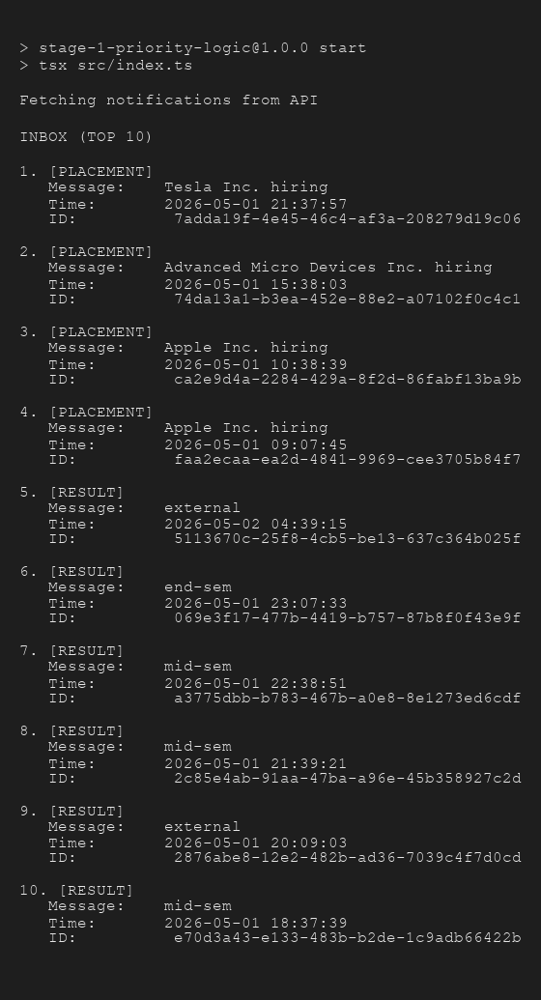

# RA2311003010208
Afford Online Test

## Stage 1

### Approach
To display the top 'n' most important unread notifications, we fetch the notifications from the provided API. We determine the priority of each notification based on two factors:
1. **Type Weight**: Placement (3) > Result (2) > Event (1)
2. **Recency**: More recent timestamps take precedence if weights are equal.

We have implemented a **Max-Heap** data structure to store and sort the notifications based on these priority rules. All fetched notifications are inserted into the Max-Heap, which efficiently maintains the highest priority notification at the root. We then extract the maximum element `n` times (where `n=10`) to retrieve the Priority Inbox.

### Handling Continuous Notifications Efficiently
Currently, the implementation uses a Max-Heap where all notifications are inserted. However, as new notifications keep coming in indefinitely, the Max-Heap will grow continuously, increasing memory usage.

**To maintain the top 10 efficiently in a streaming scenario:**
The optimal approach is to use a **Min-Heap of size `k`** (where `k = 10` is the number of top notifications we want to display), where the sorting logic is inverted (the root is the lowest priority out of the top 10). 
- When a new notification arrives, we compare it against the root of the Min-Heap (the 10th most important notification).
- If the new notification has a **lower or equal priority**, it is discarded.
- If it has a **higher priority**, we extract the root (`extractMin`) and `insert` the new notification into the Min-Heap.
This approach ensures that we only ever store exactly 10 elements in memory (Space Complexity: `O(k)`) and processing each new notification takes at most `O(log k)` time.

### Screenshot

